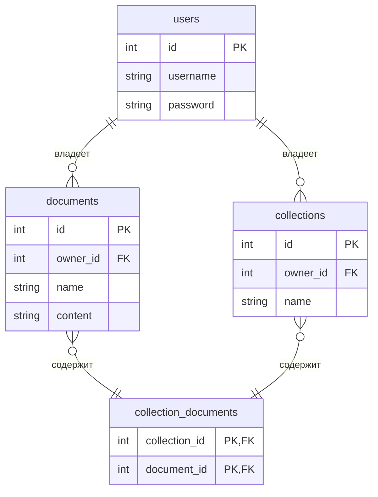

# TF-IDF Web App (Go + PostgreSQL)

## Быстрый старт через Docker Compose

1. Создайте файл `docker-compose.yml` в корне проекта со следующим содержимым:

```yaml
version: '3.8'
services:
  db:
    image: postgres:15
    environment:
      POSTGRES_DB: test
      POSTGRES_USER: gb_user
      POSTGRES_PASSWORD: gbsecurity
    ports:
      - "5432:5432"
    volumes:
      - pgdata:/var/lib/postgresql/data

  app:
    build: .
    depends_on:
      - db
    environment:
      DB_HOST: db
      DB_PORT: 5432
      DB_USER: gb_user
      DB_PASSWORD: gbsecurity
      DB_NAME: test
    ports:
      - "8080:8080"
    restart: unless-stopped

volumes:
  pgdata:
```

2. Измените строку подключения к базе данных в `main.go` на использование переменных окружения (или используйте готовую строку, если не хотите менять код):

```
"host=localhost port=5432 user=gb_user password=gbsecurity dbname=test sslmode=disable"
```

Для работы с Docker Compose лучше использовать:
```
"host=" + os.Getenv("DB_HOST") + " port=" + os.Getenv("DB_PORT") + " user=" + os.Getenv("DB_USER") + " password=" + os.Getenv("DB_PASSWORD") + " dbname=" + os.Getenv("DB_NAME") + " sslmode=disable"
```

3. Соберите и запустите контейнеры:
```sh
docker-compose up --build
```

4. Приложение будет доступно на [http://localhost:8080](http://localhost:8080)

---

## Остановка контейнеров
```sh
docker-compose down
```

## Структура Базы Данных

Приложение использует следующие таблицы в базе данных PostgreSQL:

### Диаграмма Сущность-Связь (ERD)



### Описание Таблиц

*   **`users`**: Хранит информацию о пользователях системы.
    *   `id`: Уникальный идентификатор пользователя (первичный ключ).
    *   `username`: Имя пользователя (уникальное).
    *   `password`: Хешированный пароль пользователя.

*   **`documents`**: Хранит загруженные текстовые документы.
    *   `id`: Уникальный идентификатор документа (первичный ключ).
    *   `owner_id`: Идентификатор пользователя, загрузившего документ (внешний ключ к `users.id`). При удалении пользователя, его документы также удаляются (`ON DELETE CASCADE`).
    *   `name`: Имя документа (уникальное).
    *   `content`: Содержимое текстового документа.

*   **`collections`**: Хранит информацию о пользовательских коллекциях документов.
    *   `id`: Уникальный идентификатор коллекции (первичный ключ).
    *   `owner_id`: Идентификатор пользователя, создавшего коллекцию (внешний ключ к `users.id`). При удалении пользователя, его коллекции также удаляются (`ON DELETE CASCADE`).
    *   `name`: Название коллекции (уникальное).

*   **`collection_documents`**: Соединительная таблица для реализации связи многие-ко-многим между документами и коллекциями.
    *   `collection_id`: Идентификатор коллекции (часть составного первичного ключа и внешний ключ к `collections.id`). При удалении коллекции, соответствующие записи здесь также удаляются (`ON DELETE CASCADE`).
    *   `document_id`: Идентификатор документа (часть составного первичного ключа и внешний ключ к `documents.id`). При удалении документа, соответствующие записи здесь также удаляются (`ON DELETE CASCADE`).

---

## Примечания
- Все данные PostgreSQL сохраняются в volume `pgdata`.
- Для продакшена рекомендуется использовать переменные окружения и не хранить пароли в коде.
